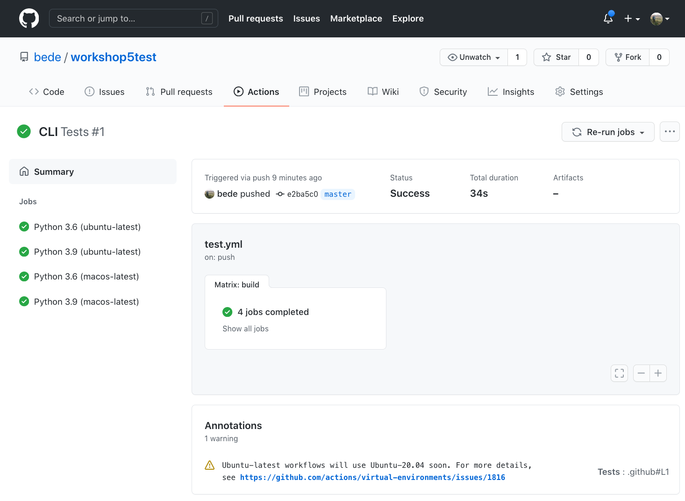

# Automated testing with GitHub Actions


Any tests are better than no tests, but automated tests are especially helpful when:

- Collaborating with others using a repository on GitHub, GitLab etc.

- Releasing software as a package to PyPI, Bioconda etc.

- Wanting to test across multiple operating systems and/or versions

  

GitHub Actions is powerful and free for open source and academic use. Other comparable platforms are also available, some of which are compatible with multiple code sharing platforms.

To follow along you will need a Linux/MacOS/WSL terminal, Python 3, a GitHub account and ideally the conda package manager. We'll clone an example python package skeleton which includes automated testing using GitHub Actions. We'll take a look at a template for testing a simple python package and upload it to our own GitHub account to see how it works.


**Starting point: https://github.com/bede/workshop5** (alternatively use workshop5.tar.gz)

- Clone the example repository  
  `git clone https://github.com/bede/workshop5.git`
  `cd workshop5`  
- Recommended: create an isolated python environment to work inside  
  `conda create -n packagename python=3`  
  `conda activate packagename`  
- Install the example package  
  `pip install .`  
- Test command line.  
  `packagename Jennifer`  
  `pytest`  
- Look inside the hidden `.github` directory  
  - Mac: `open .github/workflows/`  
  - This reveals the file `.github/workflows/test.yaml`  
  ```yaml
  name: Tests
  on: [push]

  jobs:
    build:
      runs-on: ${{ matrix.os }}
      strategy:
        matrix:
          os: [ubuntu-latest, macos-latest]
          python-version: [3.6, 3.9]
      name: Python ${{ matrix.python-version }} (${{ matrix.os }})
      steps:
        - uses: actions/checkout@v2
        - name: Set up Python ${{ matrix.python-version }}
          uses: actions/setup-python@v2
          with:
            python-version: ${{ matrix.python-version }}
        - name: Install dependencies
          run: |
            python -m pip install --upgrade pip
            pip install pytest
            pip install .
        - name: Test with pytest
          run: |
            pytest
  ```
- Sign in to https://github.com and create a new repository called e.g.  `workshop-5-test`  

- Tell your local repository where this new remote repository lives:  
  `git remote add test https://github.com/bede/workshop5test.git`   

- Push your local copy to this new remote repository:  
  `git push test master` 

- Go back to your repository page on GitHub and click on the 'Actions' tab. Hopefully there should be some tests running already! Click on them to see further details of the tests being run:  
